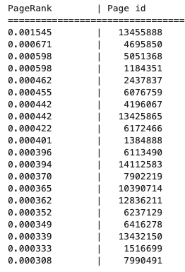
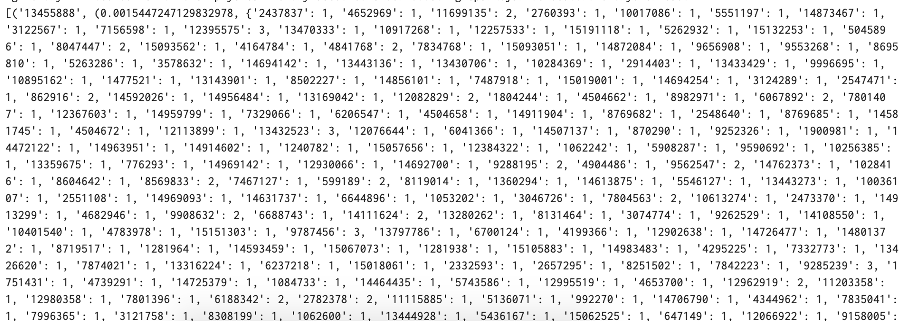

# Homework 5: Distributed Graph Processing 

In this homework you will implement Page Rank on data from a subset of the Wikipedia hyperlink graph. While the bulk of this assignment (including doing EDA and developing the algorithm on your toy datasets) can be done locally. The final spark job in question 8 is computationally heavy and you will want to run it on a cluster. To facillitate this we are providing Google Cloud credits. Follow the instructions in the [environment repo](https://github.com/UCB-w261/w261-environment/tree/master/gcp/account-setup) to set up your account and create a cluster. 

### How to submit your work:
**This assignment is due Wed 8am before Live Session 11**. Submit your work by pushing your completed notebook and supplemental files to your assigned student repository on Git. The file structure should look like this:
```
S18-1-<user>
    --Assignments
        --HW1
        --HW2
        --HW3
        --HW4
        --HW5
           |__ etc ...
     --HelpfulResources
     etc..
```


### Tips:
* Make use of your peers and TAs by asking questions on Slack. Everyone comes to MIDs from a

### Reporting results:
* Your output must be human legible. Below is an example, of what is and isn't accpetable:

YES!   


DO NOT DO THIS (You wouldn't want to have to read this either, so don't do it):   


